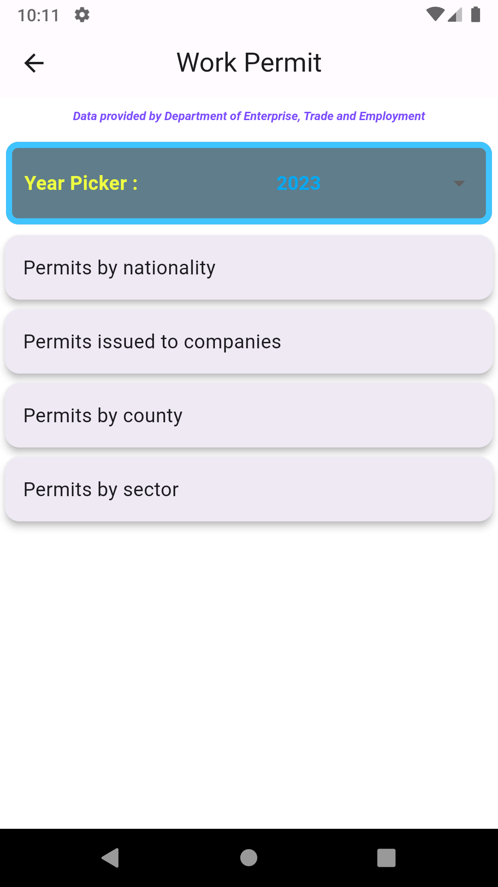
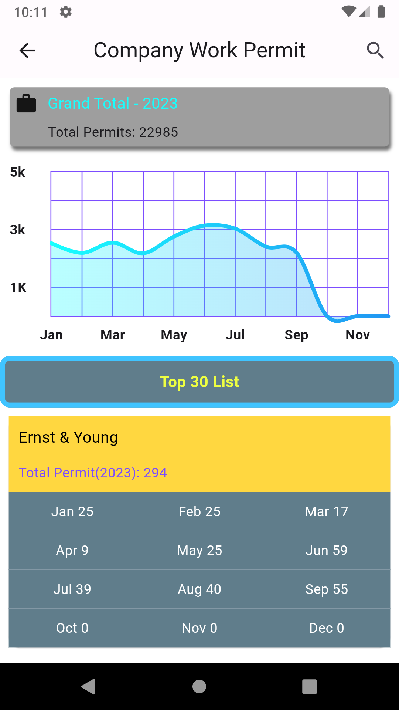
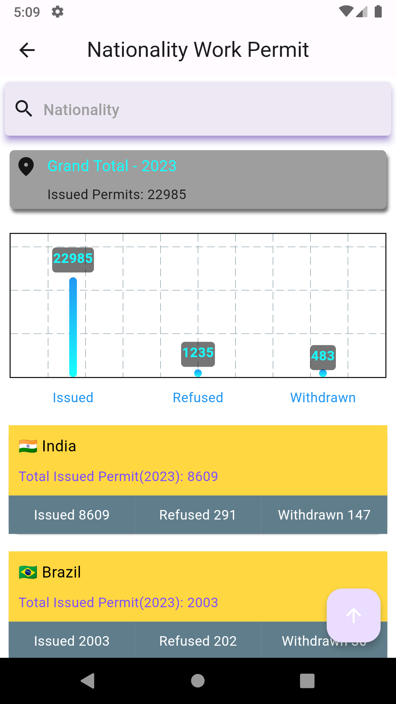
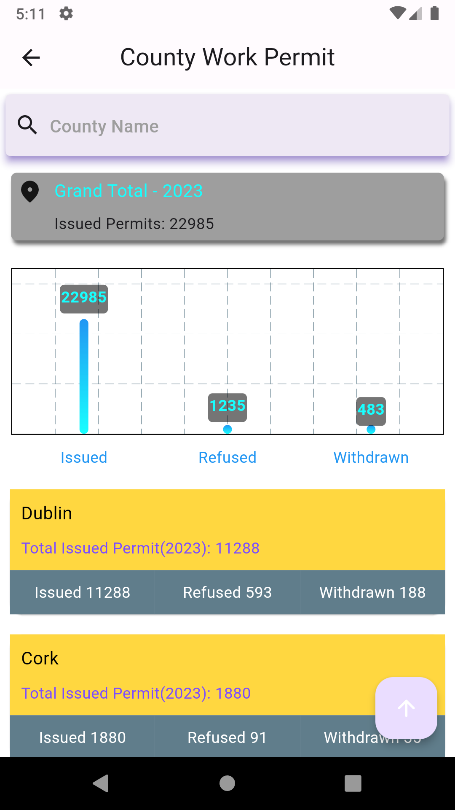
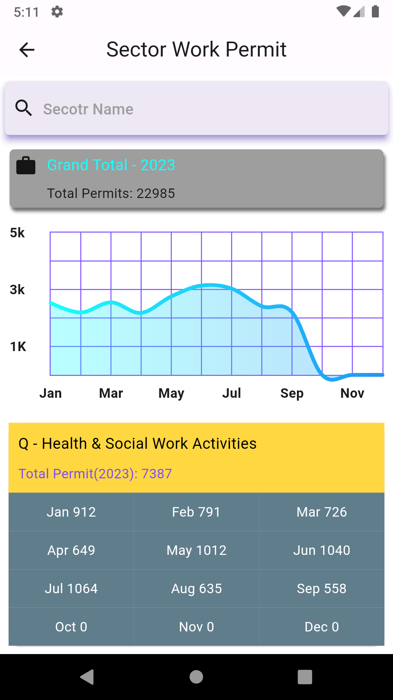
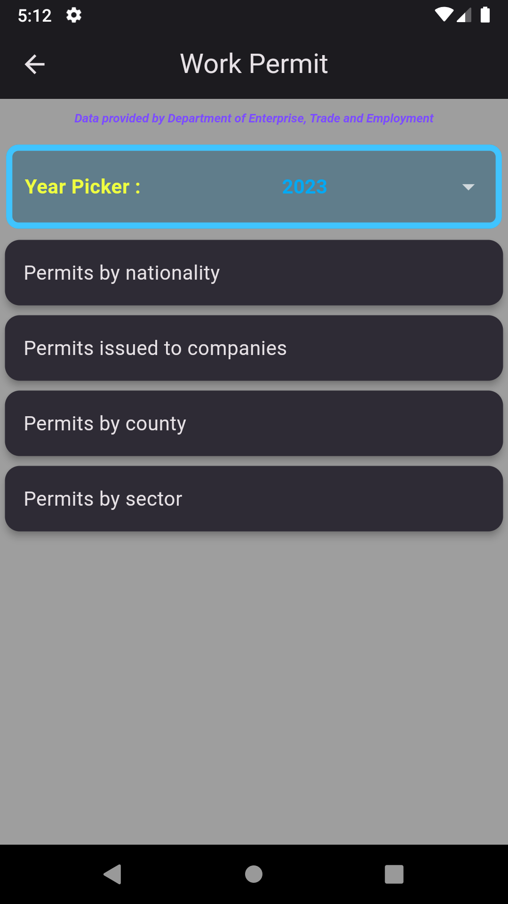
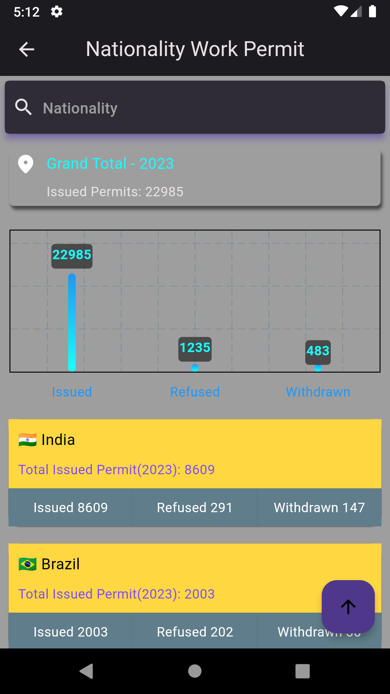
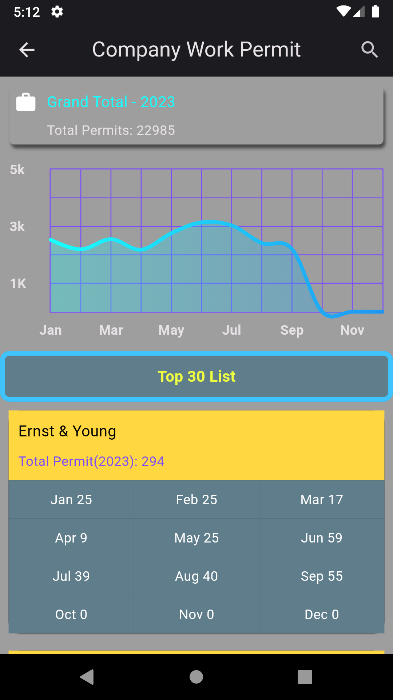
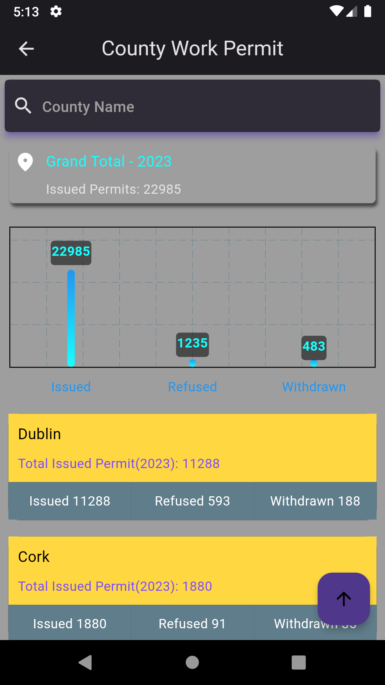
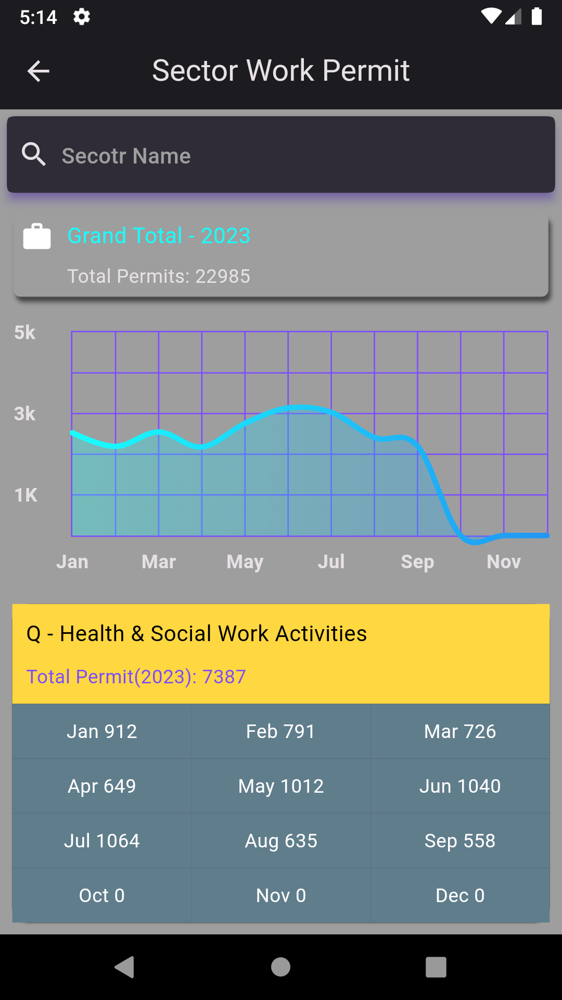

# IrelandStatistics-Mobile

This project aims to demonstrate diverse statistics in Ireland on different end-clients.

It employed [Dart](https://dart.dev/) && [Flutter][(https://flutter.dev/) as the basis to develop mobile applications running on Android & IOS.
APIs are empowered by the project [IrelandStatistics-Backend](https://github.com/freestyletime/IrelandStatistics-Backend).

The purpose of this project is to demonstrate boring-and-drowsy data to users in a friendly way. (see screenshots)

## Development Environment
* Dart
* Flutter
* Android Studio

## 3-party libraries
* [Dio](https://pub.dev/packages/dio)
* [get_it](https://pub.dev/packages/get_it)
* [fl_chart](https://pub.dev/packages/fl_chart)
* [event_bus](https://pub.dev/packages/event_bus)
* [flutter_bloc](https://pub.dev/packages/flutter_bloc)
* [flutter_emoji](https://pub.dev/packages/flutter_emoji)
* [url_launcher](https://pub.dev/packages/url_launcher)
* [pretty_dio_logger](https://pub.dev/packages/pretty_dio_logger)
* [connectivity_plus](https://pub.dev/packages/connectivity_plus)
* [shared_preferences](https://pub.dev/packages/shared_preferences)
* [cached_network_image](https://pub.dev/packages/cached_network_image)
* [modal_progress_hud_nsn](https://pub.dev/packages/modal_progress_hud_nsn)

## ScreenShots

## License

[Apache-2.0](http://opensource.org/licenses/Apache-2.0)